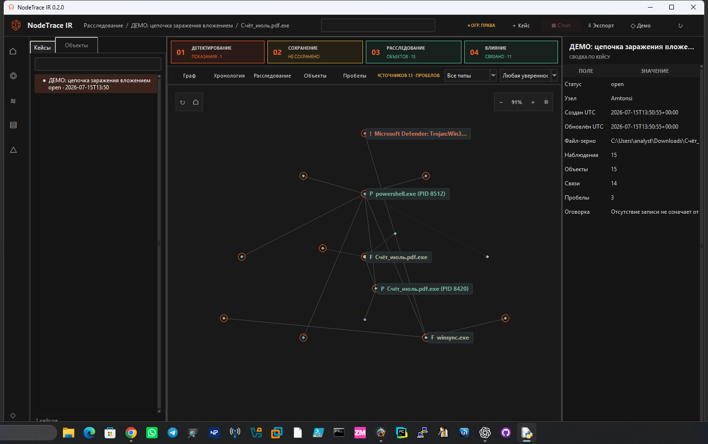
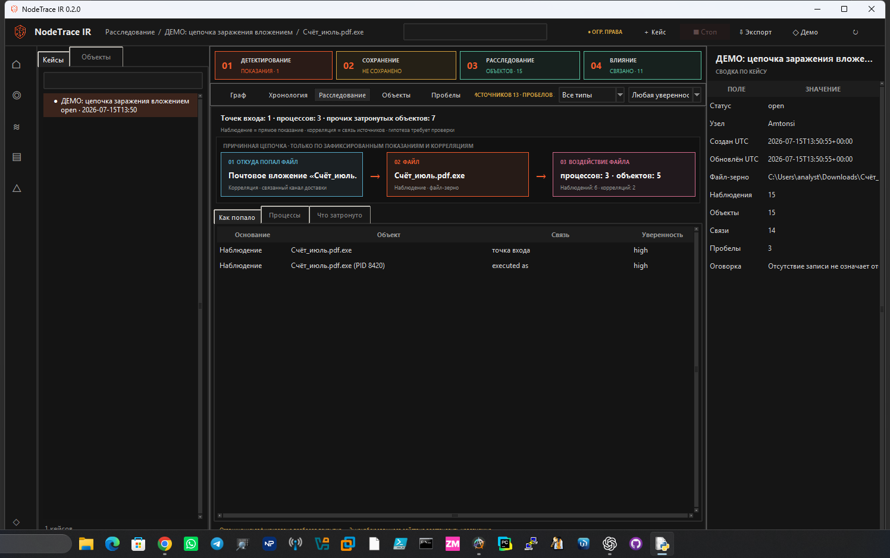
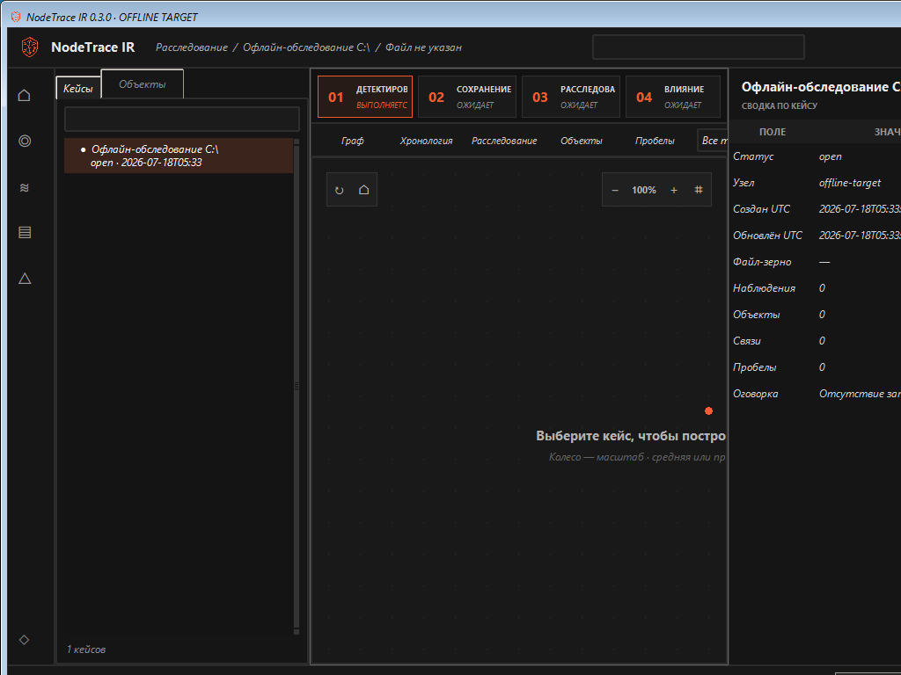

# NodeTrace IR

[](LICENSE)  

**Автор и правообладатель:** Абдрахманов Амаль Даулетович

<p align="center">
  
</p>
<p align="center"><sub>Автоматическое расследование локального Windows-узла без кнопки запуска.</sub></p>

NodeTrace IR 0.3.0 — локальный defensive-инструмент первичного расследования инцидентов на Windows-узле. Основной вариант поставки — **реально загрузочный x86 WinPE ISO с AVZ**. После загрузки WinPE сам находит отключённую установку Windows и отдельный writable-носитель для доказательств, создаёт кейс и запускает расследование. Кнопки «Старт», «Сбор» или «Анализ» нажимать не требуется.

Подозрительный файл не запускается и не загружается как библиотека. NodeTrace IR и AVZ читают доступные артефакты в аналитическом профиле; лечение, удаление, карантин и исправление исследуемой системы отключены.

**English summary.** NodeTrace IR 0.3.0 is a local-first Windows incident-response tool. Its primary distribution is a bootable x86 WinPE image that automatically investigates a mounted offline Windows installation, stores evidence on a separate writable volume, uses AVZ as an analytical detector, and exports a detailed HTML report plus a scalable SVG graph. Findings remain evidence-bounded: absent telemetry is reported as a gap, not replaced with a guess.

## Как выглядит расследование

<p align="center">
  
</p>
<p align="center"><sub>Связи снабжаются уровнем уверенности; отсутствие прямого артефакта не подменяется догадкой.</sub></p>

Внутренний конвейер выполняется в порядке **DETECT → PRESERVE → INVESTIGATE → IMPACT**, а результат показывается как причинная цепочка:

```text
источник попадания  →  файл  →  воздействие
URL / USB / другое     хэши      процессы, файлы, реестр,
                                 закрепление, сеть
```

1. **DETECT.** В x86 WinPE AVZ сначала сканирует смонтированное дерево отключённой Windows. Live-проверки процессов, ядра и сети WinPE отключены: они описывали бы среду загрузки, а не исследуемую ОС.
2. **PRESERVE.** Доступные исходные материалы, отчёты AVZ и хэши фиксируются в каталоге кейса на отдельном носителе.
3. **INVESTIGATE.** Офлайн-коллекторы читают доступные EVTX, Prefetch, файловые метаданные, постоянные записи браузеров и историю установки USB-устройств.
4. **IMPACT.** Связи делятся на наблюдения, корреляции и гипотезы. Недоказанная связь не повышается до факта.

AVZ — сторонний детектор, а не источник окончательного вердикта. Отсутствие срабатывания, успешный код завершения AVZ или `CheckFile=0` не доказывают отсутствие компрометации.

## Автоматический загрузочный режим

<p align="center">
  
</p>
<p align="center"><sub>Реальный smoke-тест VirtualBox: WinPE загрузился, нашёл offline Windows и создал SQLite-кейс на отдельном evidence-томе.</sub></p>

После загрузки ISO выполняются `wpeinit` и `winpe\launch_nodetrace.cmd`. Launcher:

- находит первую Windows-установку по `Windows\System32\Config\SYSTEM` и `SOFTWARE`;
- не использует `X:` и исследуемый том для хранения результатов;
- предпочитает внешний том с маркером `NODETRACE_EVIDENCE_VOLUME` в корне;
- иначе выбирает первый отдельный writable-том без другой Windows-установки;
- создаёт `NodeTraceIR-Evidence\session-*` и запускает:

```text
NodeTraceIR.exe --winpe --offline-root <Windows> --data-dir <evidence session>
```

Если BitLocker-том закрыт, сначала разблокируйте его штатными средствами WinPE и повторно запустите `launch_nodetrace.cmd`. Если отдельного writable-тома нет, расследование не начинается: результаты намеренно не записываются на исследуемый диск или только во временный `X:`.

После завершения WinPE-режим автоматически создаёт проверяемый ZIP и помещает рядом удобные копии `report.html`, `graph.svg`, `impact.json` и `SHA256SUMS.txt`. В HTML встроен тот же граф; отдельный `graph.svg` имеет `viewBox` и масштабируется без потери качества.

## Точный URL и идентификаторы USB

NodeTrace IR показывает точное значение только тогда, когда оно присутствует в сохранённом артефакте:

- `HostUrl` и `ReferrerUrl` из `Zone.Identifier`;
- URL-цепочки загрузок из офлайн-баз `History` Chromium-браузеров (Edge/Chrome);
- USB instance ID, VID/PID, модель и извлекаемый серийный идентификатор из офлайн-журнала `Windows\INF\setupapi.dev.log`;
- идентификаторы текущего съёмного тома, когда файл действительно исследуется на этом томе.

Совпадение имени или времени не доказывает, что конкретные байты пришли по найденному URL. Историческая запись об USB-устройстве также сама по себе не доказывает копирование файла с этого устройства. Если прямой связи нет, отчёт показывает источник как неустановленный и перечисляет пробелы покрытия, а не выбирает наиболее похожий URL или USB.

## Что доступно и недоступно офлайн

Загрузочный режим лучше отделён от потенциально заражённой ОС, но не восстанавливает данные, которых нет на диске.

Доступны, если артефакты сохранились:

- EVTX через нативный read-only parser, с явным fallback/gap при ошибке;
- Windows Prefetch и файловый временной контекст;
- Edge/Chrome download history, включая сохранённые URL;
- SetupAPI USB device-install history;
- хэши и метаданные доступных файлов;
- отчёт AVZ по смонтированному дереву Windows.

Недоступны или принципиально ограничены:

- текущие процессы заражённой Windows, оперативная память, TCP-соединения и DNS-кэш;
- уже удалённые или перезаписанные журналы;
- полное исследование MFT/USN и memory forensics;
- точная причинность там, где нет прямой телеметрии;
- содержимое зашифрованного тома до его разблокировки.

Поэтому NodeTrace IR не заменяет forensic imaging, EDR/SIEM, сетевые сенсоры, песочницу и работу аналитика.

## Требования к сборке bootable ISO

AVZ поставляется как x86 PE. В amd64 WinPE нет WOW64, поэтому AVZ там не запускается. Основной AVZ-образ собирается на базе **x86 WinPE из Windows 10 ADK/WinPE add-on 2004** с 32-разрядным CPython/PyInstaller. Новые Windows 11 ADK не содержат x86 WinPE; сверяйте это с [официальной таблицей Microsoft ADK](https://learn.microsoft.com/windows-hardware/get-started/adk-install).

Нужны:

- Windows и PowerShell; повышенные права нужны только для опционального DISM/ADK-пути;
- официальные x86 payload Windows 10 ADK/WinPE add-on 2004, полученные после принятия лицензии Microsoft;
- `wimlib-imagex` для переносимого обслуживания WIM без монтирования и повышения прав;
- CPython 3.11+ x86, PyInstaller и pytest;
- официальные архивы AVZ, проверенные по закреплённому `tools/avz-manifest.json`;
- разрешение правообладателя AVZ для предполагаемого сценария использования.

Сначала установите build-зависимости и соберите x86 EXE именно 32-разрядным Python. Штатный сценарий сам запускает тесты, проверяет разрядность интерпретатора и помещает результат в `dist\winpe-x86\NodeTraceIR.exe`:

```powershell
& C:\Python311-x86\python.exe -m pip install pytest pyinstaller
powershell -NoProfile -ExecutionPolicy Bypass `
  -File .\scripts\build_release.ps1 `
  -Python C:\Python311-x86\python.exe `
  -Architecture x86
```

Получите только закреплённые AVZ-входы после изучения [условий стороннего ПО](iso/THIRD_PARTY_AVZ_NOTICE.txt):

```powershell
powershell -NoProfile -File .\tools\fetch_avz.ps1 `
  -AcceptNonCommercialLicense `
  -Destination .\tools\cache `
  -ManifestPath .\tools\avz-manifest.json
```

Подготовьте кэш официальных WinPE-входов из Windows 10 ADK/WinPE add-on 2004.
`prepare_winpe_2004_x86_portable.ps1` **не выполняет сетевую загрузку**: он
fail-closed находит под `CacheDir` уже полученные официальные
bootstrap/MSI/CAB, проверяет их закреплённые размеры, SHA-256/SHA-1 и подписи
Microsoft, извлекает только требуемые члены и создаёт manifest происхождения.
Полный перечень ожидаемых имён и хэшей находится непосредственно в сценарии.
Получайте эти файлы официальным Microsoft layout-installer или одобренным
организацией загрузчиком; не переименовывайте произвольные файлы под ожидаемые
имена.

В `CacheDir`, `CacheDir\Installers` или
`CacheDir\winpe-layout\Installers` должны находиться:

- `adksetup.exe` и `adkwinpesetup.exe`;
- `Windows PE x86 x64-x86_en-us.msi`;
- `Windows PE x86 x64 wims-x86_en-us.msi`;
- `Windows Deployment Tools-x86_en-us.msi`;
- `690b8ac88bc08254d351654d56805aea.cab`;
- `aa25d18a5fcce134b0b89fb003ec99ff.cab`;
- `5d984200acbde182fd99cbfbe9bad133.cab`.

Внешний кэш в примере остаётся в `..\downloads\adk2004`, а извлечённые WIM и
manifest — в игнорируемом `build\winpe-input`. Ни входы Microsoft, ни
извлечённый WIM не включаются в source ZIP:

```powershell
powershell -NoProfile -ExecutionPolicy Bypass `
  -File .\scripts\prepare_winpe_2004_x86_portable.ps1 `
  -CacheDir ..\downloads\adk2004 `
  -OutputDir .\build\winpe-input `
  -AcceptMicrosoftLicense
```

`OutputDir` должен быть новым или пустым. Основной релизный путь — переносимая
сборка без установки ADK и без повышения прав:

```powershell
powershell -NoProfile -ExecutionPolicy Bypass `
  -File .\scripts\build_winpe_iso_portable.ps1 `
  -WinPEMediaRoot .\build\winpe-input\Media `
  -WinPEExtractionManifest .\build\winpe-input\extraction-manifest.json `
  -EfiBootImage .\build\winpe-input\Media\fwfiles\efisys.bin `
  -WimlibImagex ..\tools\wimlib-1.14.5\wimlib-imagex.exe `
  -NodeTraceExecutable .\dist\winpe-x86\NodeTraceIR.exe `
  -AvzDirectory .\tools\cache `
  -OutputPath .\dist\NodeTraceIR-AVZ-0.3.0-Bootable-x86.iso `
  -AcceptNonCommercialLicense
```

Сценарий проверяет PE-архитектуру NodeTrace IR и AVZ, manifest официального WinPE, хэши архивов и каждого извлечённого элемента, встраивает payload и автозапуск в `boot.wim`, создаёт BIOS/IA32-UEFI El Torito ISO и записывает `.iso.sha256`, `.verification.json` и `.build.json`.

## Проверка ISO перед публикацией

Статическая проверка загрузочного каталога и обязательного WIM:

```powershell
python .\scripts\verify_bootable_iso.py `
  .\dist\NodeTraceIR-AVZ-0.3.0-Bootable-x86.iso `
  --expect-path SOURCES/BOOT.WIM

Get-FileHash `
  .\dist\NodeTraceIR-AVZ-0.3.0-Bootable-x86.iso `
  -Algorithm SHA256
```

Успешная статическая проверка доказывает целостность структуры El Torito, но не совместимость с каждой прошивкой. Перед релизом выполните smoke boot в отдельной BIOS/IA32-UEFI VM с тестовым офлайн-томом Windows и отдельным evidence-диском; убедитесь, что приложение стартует автоматически и формирует HTML/ZIP без записи на исследуемый том.

Для изолированного BIOS smoke в VirtualBox (сеть, USB, clipboard и drag-and-drop отключаются сценарием):

```powershell
.\scripts\smoke_test_winpe_vm.ps1 `
  -IsoPath .\dist\NodeTraceIR-AVZ-0.3.0-Bootable-x86.iso `
  -BuildRoot .\build\vm-smoke `
  -BootTimeoutSeconds 90
```

По умолчанию это не только проверка загрузки. Сценарий локально создаёт два
одноразовых MBR/FAT16-образа: синтетический том-цель с путями
`Windows/System32/Config/SYSTEM` и `SOFTWARE`, а также отдельный writable-том с
маркером `NODETRACE_EVIDENCE_VOLUME`. Образы конвертируются в два VDI внутри
строго ограниченного каталога сессии и подключаются к разным SATA-портам; сеть,
USB, clipboard и общие папки не включаются. После снимка экрана evidence-VDI
экспортируется обратно в RAW, и `build_fat16_disk.py` подтверждает появление
`NodeTraceIR-Evidence/session-*/nodetrace_ir.sqlite3`. Поэтому успешный результат
доказывает автоматический запуск приложения, а не только старт WinPE. На хосте
не форматируется ни один физический диск, а внутри WinPE не выполняются
`diskpart`/`format`. Для узкой проверки только загрузки укажите
`-DisableFunctionalProbe`.

Скрипты `build_iso.py` и `build_fat12_efi.py` используются переносимым сценарием для детерминированной низкоуровневой сборки и проверки гибридного каталога. `build_winpe_iso.ps1` сохранён как опциональный путь для машины с установленным ADK и повышенной PowerShell, но не является релизным значением по умолчанию.

Низкоуровневые `fetch_winpe_2004_x86.ps1`,
`fetch_winpe_2004_x86_selective.ps1`, `resume_http_ranges.py`,
`resume_range_parts.ps1`, `extract_mszip_ranges.py` и `inspect_cab.py`
предназначены для проверяемого получения или восстановления отдельных
официальных payload в нестабильной сети. Они не заменяют полный кэш, который
проверяет `prepare_winpe_2004_x86_portable.ps1`.

## Обновление баз AVZ

Подробный пошаговый регламент, включая проверку candidate, откат и пересборку
ISO: [docs/AVZ_DATABASE_UPDATES_RU.md](docs/AVZ_DATABASE_UPDATES_RU.md).

**Загрузочный ISO никогда не обновляет AVZ через сеть во время расследования.** Это нарушило бы воспроизводимость носителя, добавило сетевую активность и заменило закреплённый вход изменяемым файлом.

Обновление выполняется только на доверенной build-машине. `update_avz_base.py` обновляет полную базу `avzbase.zip`; runtime-архив `avz4.zip` остаётся отдельным закреплённым входом и проверяется через `fetch_avz.ps1`. Официальные страницы: [загрузка AVZ](https://z-oleg.com/secur/avz/download.php) и [описание обновления баз](https://z-oleg.com/secur/avz_doc/avz_avupdate.htm).

```powershell
# Скачать и проверить кандидат; текущий pin не меняется.
python .\tools\update_avz_base.py `
  --accept-noncommercial-license

# После проверки candidate ZIP и diff manifest — зафиксировать просмотренные хэши.
$baseSha = (Get-FileHash .\tools\cache\avzbase.candidate.zip -Algorithm SHA256).Hash
$manifestSha = (Get-FileHash .\tools\avz-manifest.candidate.json -Algorithm SHA256).Hash

# Принять именно просмотренную пару. Повторная загрузка не выполняется.
python .\tools\update_avz_base.py `
  --accept-noncommercial-license `
  --approve-repin `
  --expected-base-sha256 $baseSha `
  --expected-manifest-sha256 $manifestSha
```

Если Python HTTPS заблокирован корпоративным trust store, скачайте именно
`https://z-oleg.com/secur/avz_up/avzbase.zip` разрешённым загрузчиком и передайте
его как непроверенный локальный кандидат: `--source-archive .\avzbase.zip`.
Структурные лимиты и все хеши применяются так же; происхождение локального файла
оператор проверяет отдельно до `--approve-repin`.

Updater разрешает только официальный HTTPS-хост, ограничивает размер загрузки и распаковки, запрещает traversal, шифрованные и неожиданные ZIP-элементы, вычисляет SHA-256/MD5 архива и SHA-256/CRC-32 каждого `.avz`. Полная база публикуется по изменяемому URL без сильной publisher-подписи, поэтому новый SHA-256 является локальным provenance pin, а не доказательством авторства содержимого.

После repin обязательно:

1. просмотрите diff `tools/avz-manifest.json` и метаданные архива;
2. повторно выполните `fetch_avz.ps1 -VerifyOnly`;
3. пересоберите ISO;
4. повторите статическую проверку, VM smoke и публикацию нового SHA-256.

Старая база остаётся внутри уже выпущенного read-only ISO; она не меняется задним числом.

## Упаковка исходников и релиза

GitHub-ready source ZIP версии 0.3.0:

```powershell
.\scripts\package_release.ps1 -Version 0.3.0 -SourceOnly
```

После сборки x86 EXE и ISO можно сформировать полный набор:

```powershell
.\scripts\package_release.ps1 `
  -Version 0.3.0 `
  -NodeTraceExecutable .\dist\winpe-x86\NodeTraceIR.exe `
  -BootableIso .\dist\NodeTraceIR-AVZ-0.3.0-Bootable-x86.iso
```

Source ZIP строится по точному allowlist имён. В него входят исходный код,
синтетические тестовые fixtures, WinPE launcher, сборщики, verifier и updater
AVZ; не входят снимки рабочего стола, кейсы, SQLite, логи, кэши,
базы/бинарники AVZ, WIM, ISO и сборочные каталоги. Упаковщик дополнительно
отклоняет credential-файлы и несколько форматов высоковероятных секретов.
Перед публичной загрузкой всё равно просмотрите список ZIP и исключите реальные
доказательства, вредоносные образцы и секреты.

## Запуск из исходников

Для разработки и отдельного live-response режима:

```powershell
python .\run_nodetrace_ir.py
python .\run_nodetrace_ir.py --data-dir E:\NodeTraceIR-Cases
```

Ручной офлайн-запуск требует явного корня цели и отдельного writable-каталога:

```powershell
python .\run_nodetrace_ir.py `
  --winpe `
  --offline-root D:\ `
  --data-dir E:\NodeTraceIR-Evidence
```

Программа отклоняет `--data-dir` внутри `--offline-root`. В live-режиме процесс запускается в исследуемой ОС и потому не имеет доверительных свойств офлайн-загрузки.

## Отчёт и проверка доказательств

Экспорт кейса содержит, в частности:

- `report.html` — автономный подробный отчёт;
- `graph.svg` и `graph.json` — масштабируемое и машинночитаемое представление связей;
- `impact.json` — оценка source → file → impact;
- `evidence.csv` и `timeline.csv`;
- исходные сохранённые отчёты AVZ;
- `manifest.json` и `SHA256SUMS.txt`.

Манифест подтверждает неизменность файлов после экспорта, но не истинность показаний исследуемой системы. ZIP кейса не является полным образом диска или памяти.

## Безопасность и лицензии

- NodeTrace IR не лечит исследуемую систему и не исполняет подозрительный файл.
- AVZ, его executable и базы не входят в MIT source distribution и регулируются отдельными условиями правообладателя.
- `-AcceptNonCommercialLicense` фиксирует подтверждение оператора, но не предоставляет дополнительных прав. Для коммерческого/корпоративного распространения получите необходимое разрешение.
- ISO и отчёты могут содержать чувствительные пути, имена пользователей, URL, идентификаторы устройств и журнал событий; защищайте их как материалы расследования.
- Политика сообщения об уязвимостях: [SECURITY.md](SECURITY.md).

Архитектура и модель доказательств описаны в [docs/ARCHITECTURE.md](docs/ARCHITECTURE.md) и [docs/EVIDENCE_MODEL.md](docs/EVIDENCE_MODEL.md). Правила участия — в [CONTRIBUTING.md](CONTRIBUTING.md). Лицензия NodeTrace IR — [MIT License](LICENSE); сведения о сторонних компонентах — в [NOTICE](NOTICE).
