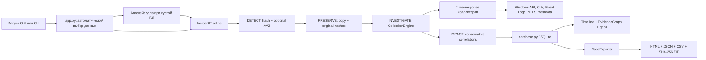
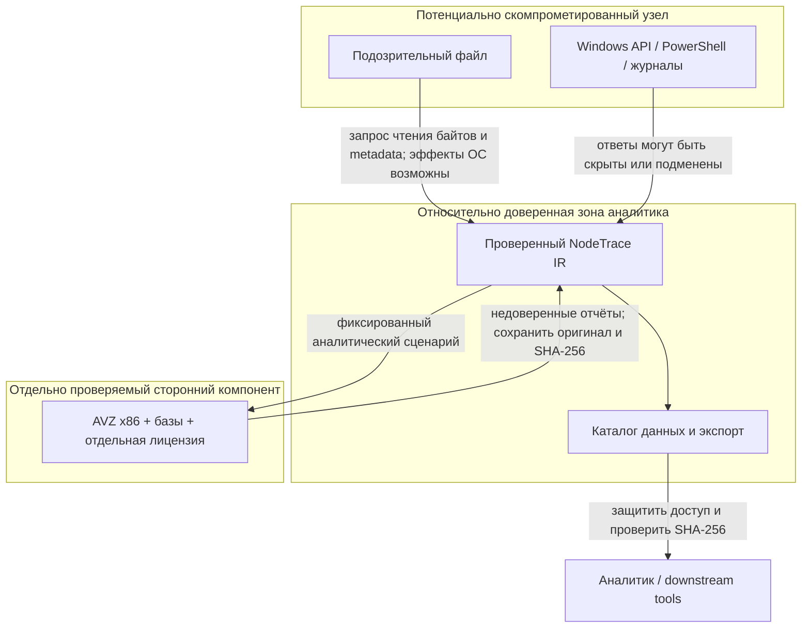

# Архитектура NodeTrace IR

## Назначение и границы

NodeTrace IR — однопользовательское local-first приложение для defensive live-response на одном Windows-узле. Оно не является агентом удалённого управления, EDR, песочницей или системой автоматического устранения последствий.

Архитектурные ограничения:

- runtime — Python 3.11+ и стандартная библиотека;
- GUI — Tkinter/ttk;
- постоянное хранилище — локальный SQLite;
- GUI выбирает каталог данных без стартового диалога, автоматически создаёт кейс текущего узла при пустой базе и запускает фоновый pipeline без отдельной кнопки анализа;
- системные запросы — фиксированные не выполняющие ремедиацию PowerShell/CIM-команды и чтение файловых метаданных;
- внешние API и облачная отправка отсутствуют; сам сетевой коллектор не создаёт соединений, но UNC-пути и системные механизмы проверки доверия остаются возможными источниками сетевой активности Windows;
- подозрительный файл не исполняется; его содержимое читается только для вычисления хэшей;
- AVZ является опциональным сторонним детектором и запускается только в аналитическом профиле без лечения, карантина, исправлений и rootkit-драйвера;
- ошибки и недоступные источники сохраняются как данные о пробелах покрытия.

## Поток данных

1. GUI выбирает каталог данных в порядке `--data-dir` → `NODETRACE_IR_DATA_DIR` → `%LOCALAPPDATA%\NodeTraceIR`. Если база пуста, он создаёт кейс текущего узла; кейс с ещё не выполненным запуском передаётся в pipeline автоматически.
2. Стадия `DETECT` при доступном файле-зерне вычисляет его хэши, ограничивает AVZ параметром `SCANFILE` на этот объект и получает системный отчёт. Без файла выполняется только системный отчёт AVZ, без наследования произвольной области сканирования.
3. `PRESERVE` копирует доступные исходные материалы, проверяет стабильность файла и фиксирует SHA-256 оригинальных байтов.
4. `INVESTIGATE` передаёт работу `CollectionEngine`; каждый коллектор получает `CollectionContext` и возвращает единый `CollectorResult`.
5. `IMPACT` консервативно обходит сохранённые связи и формирует наблюдения, корреляции и гипотезы о входе и влиянии. Он не повышает временное совпадение до причинности.
6. GUI показывает нормализованные факты, связи и gaps по мере фоновой работы, а `CaseExporter` строит автономный набор для передачи и проверки целостности. Созданный вручную кейс также запускается сразу после сохранения.

## Компоненты

| Компонент | Ответственность |
|---|---|
| `run_nodetrace_ir.py` | минимальная точка входа |
| `nodetrace_ir/app.py` | CLI, Tkinter GUI, выбор каталога и автокейса, немедленный фоновый запуск pipeline, остановка, выбор кейса и экспорт |
| `nodetrace_ir/admin.py` | только проверка, содержит ли текущий Windows token права администратора |
| `nodetrace_ir/contracts.py` | dataclass-контракты коллектора и каноническое хэширование JSON |
| `nodetrace_ir/models.py` | типизированные записи БД |
| `nodetrace_ir/engine.py` | порядок запуска, прогресс, кооперативная отмена и изоляция ошибок |
| `nodetrace_ir/pipeline.py` | оркестрация `DETECT → PRESERVE → INVESTIGATE → IMPACT` |
| `nodetrace_ir/preservation.py` | сохранение копий исходных материалов и проверка их хэшей |
| `nodetrace_ir/impact.py` | консервативная оценка входа, затронутых сущностей и пробелов |
| `nodetrace_ir/avz/` | безопасный профиль запуска AVZ, импорт и ограниченный разбор отчётов |
| `nodetrace_ir/database.py` | схема SQLite, транзакционное сохранение, дедупликация и журнал действий |
| `nodetrace_ir/collectors/` | семь defensive источников данных |
| `nodetrace_ir/graph_view.py` | интерактивный граф без внешней графической зависимости |
| `nodetrace_ir/report.py` | HTML/JSON/CSV экспорт, манифест и SHA-256 |
| `nodetrace_ir/demo.py` | синтетический учебный кейс |
| `assets/` | значки приложения в ICO и PNG; не содержит материалов реальных расследований |
| `gui-smoke.png` | проверочный скриншот GUI с синтетическим демо-кейсом |

## Контракт коллектора

`CollectionContext` содержит:

- `case_id` и путь к файлу-зерну;
- время старта и глубину ретроспективы;
- отдельный каталог артефактов запуска;
- `cancel_event`;
- ограниченные опции коллектора.

`CollectorResult` содержит четыре независимых набора:

- `evidence` — наблюдаемые объекты;
- `relations` — утверждения о связи между объектами;
- `gaps` — явно описанные потери покрытия;
- `raw_payload` — сводный технический результат источника.

Коллектор не пишет в SQLite самостоятельно. Это сохраняет единое место для транзакций, дедупликации и аудита.

## Интеграция AVZ

NodeTrace IR не переупаковывает AVZ как собственный модуль и не меняет его файлы. Адаптер принимает отдельно полученную проверенную копию, формирует фиксированный скрипт и вызывает `avz.exe` по абсолютному пути с `shell=False`, изолированными каталогами `TempFolder`/отчётов и конечным timeout.

Профиль принудительно отключает удаление, лечение, карантин, исправления LSP/реестра/системных проблем, AVZGuard, update/FTP и rootkit-детект с загрузкой драйвера. Команды ремедиации и стандартные лечебные сценарии не входят в разрешённый набор. Это защищает доказательства от намеренного изменения интеграцией, но сам запуск процесса AVZ всё равно меняет volatile-состояние live-системы.

При доступном файле-зерне AVZ получает командную область `SCANFILE` только для этого объекта, выполняет аналитическое сканирование и создаёт системный отчёт. Без файла `RunScan` не вызывается и формируется только системный отчёт. Оригинальные байты отчётов сохраняются до разбора вместе с размером и SHA-256; текст может быть в Windows-1251. Импортёр принимает UTF-8/UTF-16/Windows-1251, но не изменяет оригинал. XML/HTML рассматриваются как недоверенные: DTD и внешние сущности запрещены, размер, глубина и объём текста ограничены.

Malware-вердикты извлекаются из сохранённых отчётов, а не из кода завершения `avz.exe`. Ненулевой код процесса, timeout или отсутствующий/неполный отчёт означают неопределённый результат и gap; код процесса `0` сообщает только об успешном техническом завершении. Значения `-1/0/1/2/3` принадлежат отдельной скриптовой функции AVZ `CheckFile`: недоступно; не классифицирован как доверенный и не обнаружен как вредоносный; вредоносный; подозрительный; доверенный/безопасный каталог соответственно. Они не являются exit codes процесса и не доказывают состояние всего узла. Срабатывание из отчёта хранится как наблюдение детектора со средней уверенностью, а не как доказанный malware-вердикт.

## Выполнение PowerShell

`collectors/helpers.py` запускает только фиксированный текст запросов:

- только штатный `System32\WindowsPowerShell\v1.0\powershell.exe` по абсолютному пути, без поиска через `PATH`;
- `shell=False`;
- `-NoProfile`, `-NonInteractive`, конечный timeout;
- без видимого консольного окна;
- с минимальным окружением и `PSModulePath`, ограниченным системными каталогами;
- непроверенные пути передаются через переменные окружения, а не интерполируются в PowerShell-код;
- JSON оборачивается в UTF-8/base64, чтобы Windows PowerShell 5.1 не повреждал локализованный текст;
- stderr, timeout и код возврата преобразуются в структурированную ошибку.

Пользовательские профили, каталоги модулей и исполняемые файлы из `PATH` не наследуются. Пути Startup разрешаются через Windows Known Folder API и передаются как `NODETRACE_*`. Это снижает риск подмены, но не устраняет границу доверия к уже скомпрометированной ОС.

Исходный Python-процесс только определяет уровень прав текущего token и не выполняет self-elevation: source-версию запускают из уже повышенной доверенной оболочки. Релизный PyInstaller EXE имеет UAC-манифест `requireAdministrator` и поэтому получает один системный запрос UAC при старте. Повышение требуется для AVZ, который иначе может завершиться `WinError 740`, и для более полного чтения источников; после подтверждения pipeline запускается автоматически.

## Изоляция сбоев и отмена

Внутри стадии `INVESTIGATE` коллекторы запускаются детерминированно:

1. fingerprint файла;
2. процессы;
3. сеть;
4. закрепление;
5. журналы;
6. файловый временной контекст;
7. Prefetch.

Исключение оборачивается в failed `CollectorResult` с `GapDraft`. Уже собранные результаты сохраняются, последующие источники продолжают работу. Итог запуска может быть `completed`, `partial`, `failed` или `cancelled`.

Отмена кооперативная: GUI устанавливает `Event`; текущий коллектор останавливается в безопасной точке, а оставшиеся помечаются отменёнными. Внешний PowerShell-процесс, уже запущенный внутри одного запроса, ограничен timeout, но не прерывается посреди атомарного вызова только установкой события.

## Хранилище

SQLite содержит таблицы:

- `cases`;
- `collection_runs`;
- `evidence`;
- `evidence_observations` (append-only таймлайн повторных сборов);
- `relations`;
- `coverage_gaps`;
- `artifacts`;
- `analyst_log`.

Каждая публичная операция БД открывает короткоживущее соединение, включает foreign keys и закрывает handle после операции. Один `CollectorResult` сохраняется транзакционно. Повторный `stable_key` в одном кейсе обновляет актуальную проекцию объекта с сохранением `first_seen_at`, но одновременно добавляет отдельную запись `evidence_observations`; связи дедуплицируются по источнику, цели и типу.

SQLite — рабочее хранилище, а не неизменяемый forensic ledger. Подробнее о последствиях — в [EVIDENCE_MODEL.md](EVIDENCE_MODEL.md).

## Представление

GUI имеет три логических слоя:

- список и метрики кейсов;
- граф/таймлайн/табличное представление;
- инспектор свойств, исходной записи и пробелов.

Вкладка расследования содержит отдельную горизонтальную причинную схему **«Откуда попал → Файл → Воздействие»**. Она не заменяет операционные стадии pipeline: `DETECT → PRESERVE → INVESTIGATE → IMPACT` описывает порядок работы программы, а причинная схема — восстановленную структуру самого инцидента. Источник доставки показывается только из связанного артефакта (`download_origin`/`delivery_source`); при отсутствии такого артефакта интерфейс явно сообщает, что источник не установлен.

Отдельной кнопки «Сбор»/«Анализ» нет. Старт приложения создаёт и запускает первичное обследование при пустой базе, а сохранение нового ручного кейса немедленно начинает его pipeline. В верхней панели остаются управление кейсом, кооперативная остановка текущей работы и экспорт; эти действия не являются условием первого запуска расследования.

`EvidenceGraph` выбирает файл-зерно как корень, раскладывает связанные объекты по уровням и визуально различает типы. Пунктирная связь означает низкую уверенность. Граф — способ навигации по утверждениям в БД, а не автоматически доказанная причинная схема.

## Экспорт

`CaseExporter` создаёт временный каталог, формирует:

- `case.json` по схеме `nodetrace-ir/case-export/v1`;
- `graph.json`;
- `graph.svg` — самостоятельный SVG с `viewBox`, пригодный для масштабирования и печати без растеризации;
- `evidence.csv`;
- `timeline.csv`;
- автономный `report.html`;
- `README.txt`;
- `manifest.json` по схеме `nodetrace-ir/manifest/v1`;
- `SHA256SUMS.txt`.

После этого каталог упаковывается в ZIP через временный файл и атомарно заменяет назначение. Для каждого полезного файла записываются размер и SHA-256, отдельно возвращается SHA-256 всего ZIP.

Экспорт не включает саму SQLite-базу, образ диска, память и оригинальные внешние источники. Он переносит текущую нормализованную модель кейса, поэтому для полноценного расследования должен храниться рядом с оригинальными доказательствами.

## Доверительные границы

Главная граница: приложение может проверить целостность сформированного набора, но не может доказать, что скомпрометированная ОС вернула истинную картину. Независимое подтверждение должно приходить из EDR/SIEM, сетевых сенсоров, сохранённых EVTX, образов диска и памяти.

## Загрузочный x86 WinPE ISO

Основной ISO 0.3.0 является загрузочным WinPE, а не файловым контейнером для запуска внутри заражённой Windows. AVZ поставляется как x86-приложение, поэтому AVZ-вариант использует x86 WinPE и x86 NodeTraceIR.exe. amd64 WinPE не предоставляет WOW64; новый Windows 11 ADK без x86 media не подходит для этого образа.

`startnet.cmd` вызывает `wpeinit`, затем launcher находит отключённую Windows по hive-файлам `SYSTEM`/`SOFTWARE`. Приложение получает явный `target_mode=offline`, `offline_root` и отдельный `data_dir`. Офлайн-коллекторы читают EVTX, Prefetch, файловые метаданные, Chromium download history и SetupAPI USB history относительно `offline_root`; live-процессы, сеть и volatile-состояние WinPE намеренно не приписываются исследуемой Windows.

Launcher отказывается хранить материалы на `X:`, на исследуемом томе или на другом обнаруженном системном томе. Он предпочитает отдельный носитель с маркером `NODETRACE_EVIDENCE_VOLUME`, создаёт на нём `NodeTraceIR-Evidence\session-*` и запускает расследование без кнопки старта. После окончания приложение автоматически экспортирует ZIP, HTML, SVG-граф и контрольные суммы на этот же носитель.

На стадии `DETECT` AVZ получает корень смонтированной Windows как область сканирования. Проверки live-процессов, ядра и сети отключены; лечение, карантин и remediation запрещены. Отчёт AVZ остаётся недоверенным входом и импортируется вместе с исходными байтами и SHA-256.

Исходный архив проекта не включает AVZ. Сборщик принимает только архивы, закреплённые `tools/avz-manifest.json`, сверяет состав и хэши и встраивает проверенные файлы в read-only WIM. База не обновляется во время загрузки: `tools/update_avz_base.py` запускается на доверенной build-машине, после явного repin ISO пересобирается и получает новый SHA-256. Корпоративное или коммерческое распространение/использование такого носителя регулируется отдельными условиями AVZ и может требовать письменного разрешения правообладателя.

Каталог `iso/` и `scripts/build_iso.ps1` сохраняют прежний live-Windows transport-вариант для совместимости, но не являются основным загрузочным релизом 0.3.0.

## Расширение

Новый источник следует добавлять через контракт коллектора, а не напрямую в GUI. Он должен иметь лимиты, timeout, тесты и описание gaps. Изменение схемы экспорта требует новой версии `schema`, обратной совместимости либо явной миграции.

Правила для pull request описаны в [CONTRIBUTING.md](../CONTRIBUTING.md).
