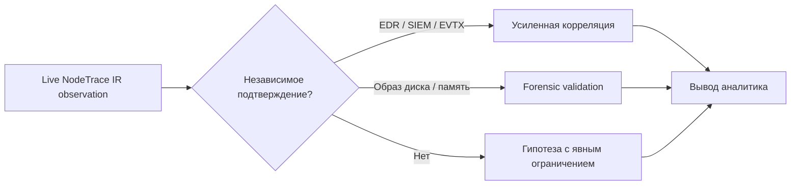

# Модель доказательств

## Цель

Модель NodeTrace IR помогает аналитику отличать наблюдение от интерпретации. Она не присваивает объекту автоматический вердикт «вредоносный» и не обещает восстановить события, которые не были записаны.

Минимальная единица результата — не просто строка таймлайна, а сочетание:

1. объекта доказательства (`Evidence`);
2. происхождения (`collector`, `source`, `source_ref`, `raw`);
3. времени наблюдения;
4. уровня уверенности;
5. опциональной связи с другим объектом;
6. известных пробелов покрытия.

## Evidence

Основные поля:

| Поле | Значение |
|---|---|
| `entity_type` | тип объекта: файл, процесс, событие, соединение, задача и т. п. |
| `label` | человекочитаемое представление |
| `observed_at` | время из источника либо время снимка в ISO-8601 UTC |
| `collector` | компонент, получивший запись |
| `source` | конкретный журнал, API, каталог или метод |
| `source_ref` | ссылка внутри источника: путь, PID, log#record и т. п. |
| `stable_key` | ключ дедупликации в пределах кейса |
| `confidence` | надёжность самого наблюдения/идентификации |
| `severity` | приоритет аналитической проверки, не вердикт |
| `properties` | нормализованные поля для UI и поиска |
| `raw` | исходная структурированная запись источника |
| `evidence_digest` | SHA-256 канонического JSON текущего представления записи |
| `first_seen_at`, `last_seen_at` | первое и последнее сохранение ключа в БД |

`evidence_digest` относится к нормализованному документу записи, а не обязательно к исходному артефакту. Для файла-зерна SHA-256 его содержимого отдельно хранится в `properties.sha256` и входит в `stable_key`.

## EvidenceObservation и таймлайн

`evidence` — актуальная проекция уникальной сущности для графа. Каждое её получение дополнительно записывается в append-only таблицу `evidence_observations` со своим `run_id`, `observed_at`, `collected_at`, исходными `properties/raw` и digest. Поэтому повторный сбор может обновить карточку сущности, но не уничтожает уже сохранённые строки таймлайна.

Автоматический старт GUI не меняет эту модель: создание автокейса, старт pipeline и его стадии журналируются как системные действия. Отсутствие отдельной кнопки «Анализ» не превращает автоматически созданные корреляции в факты и не скрывает происхождение запуска.

Точный дубль одного и того же документа внутри одного запуска подавляется. То же наблюдение в другом запуске сохраняется отдельно — это важно для сравнения состояния и аудита действий сборщика.

## Relations

Связь — отдельное утверждение:

- `source_key` и `target_key`;
- `relation_type`;
- `confidence`;
- обязательное текстовое `rationale`;
- `observed_at`.

Примеры:

- `owns_connection` — API напрямую указал PID владельца TCP-соединения;
- `reported_parent_of` — снимок Win32_Process указал parent PID, но возможен PID reuse;
- `possible_persistence_reference` — команда закрепления содержит полный путь или имя подозрительного файла;
- `temporally_adjacent_file` — временная метка близка к файлу-зерну, причинность не доказана;
- `possible_prefetch_name_match` — совпало имя EXE, но не полный путь и не содержимое.
- `reported_download_source` — `HostUrl`/`ReferrerUrl` прочитан из `Zone.Identifier`; это наблюдаемая метаинформация, но изменяемый alternate stream не доказывает фактическую доставку;
- `reported_delivery_source` — внешний источник телеметрии связал канал доставки с файлом; сила вывода определяется происхождением и уверенностью этой записи.
- `present_on_removable_media` — во время сбора файл непосредственно находился на USB/съёмном томе с зафиксированными идентификаторами; это доказывает текущее местоположение, но не доказывает прошлый путь доставки на другой диск.

Граф визуализирует эти утверждения, но не преобразует корреляцию в доказанную причинность.

Причинное представление всегда читается как **источник попадания → файл → воздействие**. Левая часть заполняется только из отдельного артефакта происхождения и связи с файлом-зерном. Если такого показания нет, сохраняется явное значение «Источник не установлен»; расположение файла в `Downloads` или наличие `ZoneId=3` сами по себе не позволяют назвать почту, браузер или конкретный URL.

Точные URL берутся только из сохранённых полей `HostUrl`/`ReferrerUrl` и никогда не запрашиваются по сети. Идентификаторы USB относятся к тому носителю, на котором файл находился во время сбора. Атрибуция уже скопированного файла конкретному ранее подключённому устройству требует отдельной исторической телеметрии и не строится по одному совпадению времени.

## Уровни уверенности

### `high`

Прямое, однозначно адресуемое значение из доступного источника: байты файла дали конкретный SHA-256; Event Log вернул record ID; `Get-NetTCPConnection` сообщил PID владельца.

`high` не означает, что источник абсолютно доверен. Rootkit или компрометация ОС всё равно могут скрыть или подменить ответ.

### `medium`

Корреляция хорошо обоснована, но имеет реальную альтернативу. Примеры: parent PID из одномоментного снимка; совпадение имени подозрительного файла в Prefetch; ссылка по одному имени без полного пути.

### `low`

Контекстная гипотеза для поиска: файл оказался близок по времени в ограниченном наборе каталогов. Такой вывод нельзя использовать без независимого подтверждения.

Уверенность должна отражать силу основания, а не субъективную тревожность объекта.

## Severity

`severity` сортирует внимание аналитика. Это не malware score и не вероятность компрометации. Например:

- отсутствие Authenticode не делает файл вредоносным;
- Windows event уровня Error может быть обычной эксплуатационной ошибкой;
- сетевое соединение с внешним IP само по себе не является IOC.

Любое автоматическое повышение severity должно иметь документированное правило и тест.

## Результаты AVZ

AVZ — детектор, а его результат является наблюдением конкретного инструмента в конкретной области сканирования. Нормализованная запись обязана сохранять версию/идентификатор профиля, область сканирования, время, исходную метку детекта и ссылку на оригинальный отчёт. Срабатывание импортируется со средней уверенностью: оно достаточно для приоритизации, но требует проверки хэша, контекста и независимого источника.

NodeTrace IR получает malware-вердикты из сохранённых отчётов AVZ, а не из кода завершения процесса `avz.exe`. Ненулевой код процесса, timeout или отсутствующий/неполный отчёт означают неопределённый результат и обязательный `CoverageGap`; успешное завершение процесса само по себе ничего не говорит о наличии детектов.

Отдельная скриптовая функция AVZ `CheckFile` возвращает следующие значения; это **не** exit codes `avz.exe`:

| `CheckFile` | Допустимая интерпретация |
|---:|---|
| `-1` | проверка недоступна |
| `0` | файл не классифицирован как доверенный и не обнаружен как вредоносный |
| `1` | файл обнаружен как вредоносный |
| `2` | файл признан подозрительным |
| `3` | файл относится к доверенному/безопасному каталогу |

Даже `CheckFile=3` относится к одному объекту и каталогу доверия конкретного инструмента, а не доказывает отсутствие компрометации узла. Текущая интеграция выводит нормализованные детекты из отчётов. В live-режиме доступный файл-зерно проверяется отдельно. В WinPE-режиме AVZ получает явный корень смонтированной Windows как область `SCAN`, а live-проверки процессов, системы, ядра и сети отключаются, чтобы не смешивать WinPE с исследуемой ОС.

Текст AVZ может использовать Windows-1251. Хэш вычисляется по исходным байтам до декодирования; декодированный текст — производное представление. Нормализация не должна удалять или перезаписывать оригинал. Для каждого отчёта фиксируются путь в каталоге артефактов, размер, SHA-256 и ошибка разбора, если она возникла.

## Оценка входа и влияния

Стадия `IMPACT` не создаёт единый непрозрачный «рейтинг ущерба». Она группирует связанные сущности по направлениям: возможный канал попадания, процессы и модули, созданные/изменённые файлы, реестр, механизмы закрепления, сервисы/драйверы и сетевые адреса. Каждое утверждение относится к одному из трёх классов:

- **наблюдалось** — конкретный источник прямо содержит адресуемую запись;
- **коррелирует** — несколько наблюдений связаны обоснованным правилом, но остаётся реальная альтернатива;
- **гипотеза** — направление дальнейшей проверки, сформированное из косвенного или неполного контекста.

Например, `Zone.Identifier` с `HostUrl` наблюдаемо указывает источник загрузки для этого файлового потока, но не доказывает личность пользователя. Запись создания процесса с совпадающим SHA-256 существенно сильнее совпадения имени. Наличие TCP-соединения у связанного PID не доказывает эксфильтрацию, а метка класса вредоносного ПО не доказывает фактическую кражу паролей. Неохваченные журналы и недоступные поля должны снижать силу вывода и появляться рядом с ним как gaps.

## Время

Все нормализованные времена хранятся как ISO-8601 UTC. Источник времени важен:

- `observed_at` может быть временем события, создания процесса, изменения файла или временем live-снимка;
- `started_at`/`finished_at` описывают работу коллектора, а не инцидент;
- `created_at` записи в БД показывает момент сохранения;
- timestamp файловой системы может быть изменён пользователем, установщиком или вредоносным ПО.

Таймлайн сортирует наблюдения по времени, но порядок строк не доказывает, что одна строка вызвала другую.

## Дедупликация и обновление

В пределах кейса `stable_key` уникален. Повторный сбор:

- сохраняет ID и `first_seen_at`;
- обновляет последнее представление, `run_id`, digest и `last_seen_at`;
- добавляет неизменяемое наблюдение текущего запуска в `evidence_observations`;
- обновляет существующую связь с той же тройкой source/target/type.

Таблица сущностей и связей остаётся изменяемой проекцией, тогда как таймлайн наблюдений append-only. Вся SQLite-база всё равно не является WORM-носителем или достаточным материалом chain of custody: экспортируйте значимые состояния, сохраняйте SHA-256 и защищайте носитель от изменения.

## Coverage gaps

`CoverageGap` — полноправный результат, а не сообщение в консоли:

| Поле | Вопрос |
|---|---|
| `source` | какой источник отсутствует или ограничен? |
| `reason` | почему данные не получены? |
| `impact` | какие выводы из-за этого нельзя сделать? |
| `recommendation` | как получить или сохранить источник в будущем? |

Типичные причины: журнал отключён, события перезаписаны, нет прав, timeout, каталог недоступен, достигнут лимит, сбор отменён. Отсутствие gap не доказывает полноту: инструмент может не знать о внешнем источнике, который никогда не был настроен.

## Доказуемость и отрицательные выводы

Корректные формулировки:

- «В доступном снимке не найдено TCP-соединений, связанных с этим PID».
- «В выбранных журналах за 7 дней нет соответствующих событий».
- «Имя файла совпадает с Prefetch-записью; это согласуется с исполнением, но не доказывает полный путь или идентичность содержимого».

Некорректные формулировки:

- «Файл точно никогда не выполнялся».
- «Мы восстановили все действия заражения».
- «Временная близость доказывает, что файл создал соседний объект».
- «Чистый live-снимок означает отсутствие компрометации».
- «Процесс AVZ завершился с кодом `0`, значит заражения нет».
- «`CheckFile` вернул `0` или `3`, значит весь узел чист».

Полная последовательность невозможна без предварительной телеметрии и её сохранности. Этот предел должен оставаться видимым в UI, отчёте и выводах аналитика.

## Целостность экспорта

Экспорт предоставляет два уровня проверки:

1. `manifest.json` и `SHA256SUMS.txt` фиксируют содержимое файлов набора;
2. SHA-256 всего ZIP фиксирует переданный контейнер.

Это позволяет обнаружить последующее изменение, но не доказывает:

- правильность часов исследуемой системы;
- полноту журналов;
- честность Windows API на заражённом узле;
- происхождение внешнего артефакта до момента сбора;
- личность оператора.

Для formal chain of custody дополнительно фиксируйте дату/время, часовой пояс, оператора, хэш и источник инструмента, команды, права, состояние узла, идентификатор носителя, хэши оригиналов и каждую передачу материалов.

## Рекомендуемая схема подтверждения

NodeTrace IR должен ускорять проверяемое мышление аналитика, а не заменять его автоматическим рассказом о причинности.
